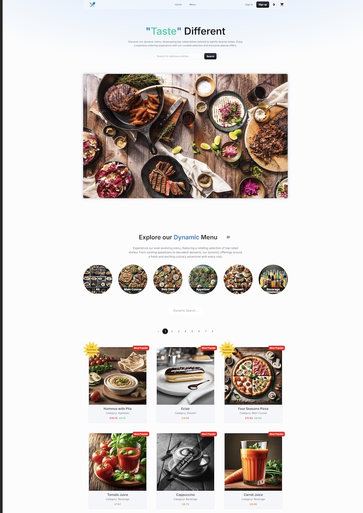
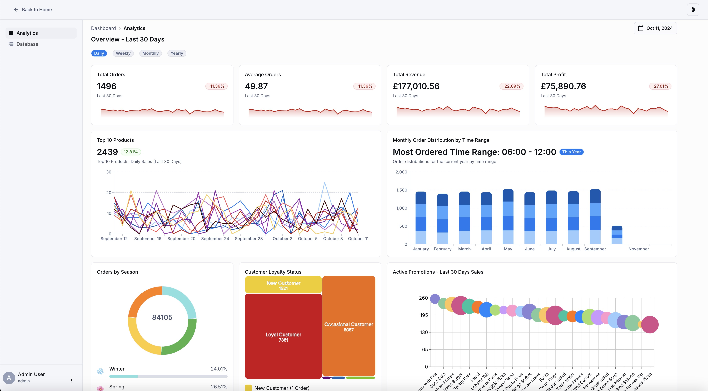

# [Food Ordering System](https://suatkocar.dev/food-ordering-system/)

## Home Page



## Admin Dashboard



## Project Overview

The Food Ordering System is a full-stack web application designed to enhance the online food ordering experience through dynamic menu optimisation based on previous order data. Built with Node.js for the backend and React.js for the frontend, it utilises real-time updates enabled through WebSocket technology. The system aims to increase sales by dynamically adjusting menu offerings and pricing strategies.

## Features

- **Dynamic Menu Optimisation**: Leverages previous order data to adjust menu items' visibility and pricing in real-time.
- **Real-Time Updates**: Uses WebSocket for instant updates on menu changes and order statuses.
- **Responsive Design**: Ensures a seamless user experience across all devices.
- **Admin Dashboard**: Provides insights into sales, order patterns, and product performance.
- **Secure Authentication**: Implements JWT for secure user authentication.

## Technologies Used

- **Backend**: Node.js, Express.js, MySQL, Redis
- **Frontend**: React.js (v18.3.1), Material-UI, Vite, Redux
- **Real-Time Communication**: WebSocket
- **Development Tools**: Visual Studio Code, Postman, TablePlus, Git, PM2

## Getting Started

### Prerequisites

- **Node.js** and **npm**
- **MySQL**
- **Redis**

### Installation

1. **Clone the repository**:

   ```bash
   git clone https://github.com/suatkocar/food-ordering-system.git
   ```

2. **Navigate to the project directory**:

   ```bash
   cd food-ordering-system
   ```

3. **Install dependencies**:

   ```bash
   npm install
   ```

### Environment Setup

Create environment configuration files in both the `backend` and `frontend` directories.

#### **1. Generate Secure Secrets**

Generate secure secrets for `SESSION_SECRET`, `JWT_SECRET`, and `GITHUB_WEBHOOK_SECRET` using the following command:

```bash
node -e "console.log(require('crypto').randomBytes(32).toString('hex'));"
```

Repeat this command three times to generate unique secrets for each variable.

#### **2. Backend `.env` Files**

Create the following `.env` files in the `backend` directory:

- `.env.production`
- `.env.development`
- `.env.network`

**Example Content**:

```ini
# Database settings
DATABASE_HOST=localhost
DATABASE_USER=your_database_username
DATABASE_PASSWORD=your_database_password
DATABASE_NAME=food_ordering
DATABASE_PORT=3306

# Redis settings
REDIS_HOST=localhost
REDIS_PORT=6379

# Backend settings
BACKEND_HOST=localhost
BACKEND_PORT=8000
BACKEND_URL=http://${BACKEND_HOST}:${BACKEND_PORT}/api

# Frontend settings
FRONTEND_HOST=localhost
FRONTEND_PORT=3001
FRONTEND_URL=http://${FRONTEND_HOST}:${FRONTEND_PORT}

# Secrets
SESSION_SECRET=your_generated_session_secret
JWT_SECRET=your_generated_jwt_secret
GITHUB_WEBHOOK_SECRET=your_generated_webhook_secret
```

Replace `your_database_username`, `your_database_password`, and the secrets with your actual credentials and generated secrets.

#### **3. Frontend `.env` Files**

Create the following `.env` files in the `frontend` directory:

- `.env.production`
- `.env.development`
- `.env.network`

**Example Content**:

```ini
# Backend API settings
VITE_API_BASE_BACKEND_HOST=localhost
VITE_API_BASE_BACKEND_PORT=8000

# Frontend settings
VITE_API_BASE_FRONTEND_PORT=3001
VITE_API_BASE_URL=http://${VITE_API_BASE_BACKEND_HOST}:${VITE_API_BASE_BACKEND_PORT}/api
```

### Database Setup

The `create-database.js` script defaults to using the 'production' environment. To run it in development mode, you need to set `NODE_ENV=development`.

#### **For Development Environment**

```bash
npm run create-database:dev
```

This command sets `NODE_ENV=development` and runs the script, using the `.env.development` file.

#### **For Production Environment**

```bash
npm run create-database
```

This command uses the default 'production' environment and the `.env.production` file.

### Running the Application

#### **Development Mode**

To start the development servers for Redis, backend, and frontend simultaneously:

```bash
npm run dev
```

The application will be available at [http://localhost:3001](http://localhost:3001).


### Production Build

To create a production build:

```bash
npm run build
```

The build output will be in the `dist` directory.

## Project Structure

```
food-ordering-system
├── README.md
├── backend
│   ├── app.js
│   ├── package.json
│   ├── package-lock.json
│   ├── src
│   │   ├── config
│   │   │   ├── index.js
│   │   │   └── ...
│   │   ├── controllers
│   │   │   ├── cartController.js
│   │   │   ├── customerController.js
│   │   │   └── ...
│   │   ├── middleware
│   │   │   ├── authenticateUser.js
│   │   │   ├── cacheControl.js
│   │   │   └── ...
│   │   ├── models
│   │   │   └── db.js
│   │   ├── routes
│   │   │   ├── cartRoutes.js
│   │   │   ├── customerRoutes.js
│   │   │   └── ...
│   │   └── utils
│   │       └── cronJobs.js
│   └── ...
├── frontend
│   ├── index.html
│   ├── package.json
│   ├── package-lock.json
│   ├── src
│   │   ├── App.jsx
│   │   ├── api
│   │   │   ├── axiosInstance.js
│   │   │   └── websocket.js
│   │   ├── components
│   │   │   ├── adminDashboard
│   │   │   │   ├── AppNavbar
│   │   │   │   ├── ControlPanel
│   │   │   │   └── ...
│   │   │   ├── homepage
│   │   │   │   ├── AppAppBar
│   │   │   │   ├── Menu
│   │   │   │   └── ...
│   │   │   └── ...
│   │   ├── pages
│   │   │   ├── AdminDashboard.jsx
│   │   │   ├── Checkout.jsx
│   │   │   └── ...
│   │   ├── redux
│   │   │   ├── slices
│   │   │   │   ├── alertSlice.js
│   │   │   │   ├── cartSlice.js
│   │   │   │   └── ...
│   │   │   └── store.js
│   │   └── ...
│   └── ...
├── database
│   ├── 0-Create-Database.py
│   ├── 1-Insert-Sample-Data-To-Database.py
│   └── ...
├── create-database.js
├── package.json
├── package-lock.json
└── ...
```

## Dependencies

The project uses a monorepo structure with `npm` workspaces. Dependencies are managed from the root directory.

- **Node.js Packages**:
  - Root `package.json` manages shared scripts and dependencies like `concurrently`, `cross-env`, `rimraf`, and `vite`.
  - Backend and frontend have their own `package.json` files for specific dependencies.

## Scripts

All commands are executed from the root directory:

- **Install Dependencies**:

  ```bash
  npm install
  ```

- **Start Development Servers**:

  ```bash
  npm run dev
  ```

- **Run in Network Mode**:

  ```bash
  npm run network
  ```

- **Build for Production**:

  ```bash
  npm run build
  ```

- **Create Database**:

  - **Development Environment**:

    ```bash
    npm run create-database:dev
    ```

  - **Production Environment**:

    ```bash
    npm run create-database
    ```

- **Other Scripts**:

  - **Test**:

    ```bash
    npm run test
    ```

  - **Lint**:

    ```bash
    npm run lint
    ```

  - **Format**:

    ```bash
    npm run format
    ```

  - **Clean**:

    ```bash
    npm run clean
    ```

## Additional Information

### **Database Configuration**

- Ensure your MySQL server is running and accessible.
- The database scripts use the credentials provided in your `.env` files.
- The database creation scripts (`0-Create-Database.py` and `1-Insert-Sample-Data-To-Database.py`) are located in the `database` directory.
- The Python scripts use the environment variables passed from Node.js.

### **Redis Server**

- The Redis server is started automatically when you run `npm run dev` or `npm run network`.
- Ensure Redis is installed on your system.

### **Application Ports**

- **Backend**: Default port `8000`
- **Frontend**: Default port `3001`
- Ensure these ports are not occupied by other applications.

## License

This project is licensed under the MIT License - see the [LICENSE.md](LICENSE.md) file for details.

## Contact

For any inquiries, please contact me at [suatkocar.dev@gmail.com](mailto:suatkocar.dev@gmail.com).
